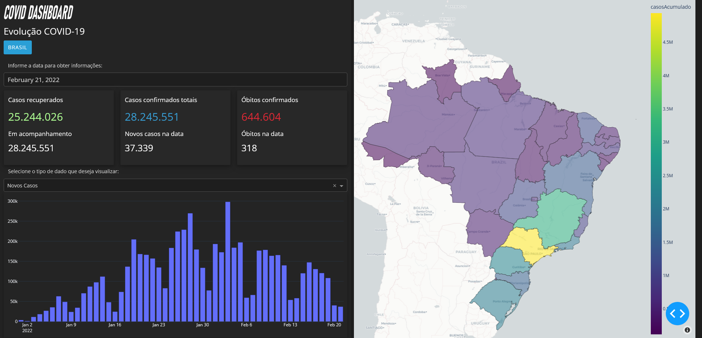

<h1 align="center">Covid_Dashboard</h1>

<div align="center" id="top"> 
  
  
  &#xa0;
  <!-- <a href="https://covid_dashboard.netlify.com">Demo</a> -->
</div> 

<p align="center">
  

  

  

  

  <!--  -->

  <!--  -->

  <!--  -->
</p>

<!-- Status -->

<!-- <h4 align="center"> 
	🚧  Covid_Dashboard 🚀 Em construção...  🚧
</h4> 

<hr> -->

<p align="center">
  <a href="#dart-sobre">Sobre</a> &#xa0; | &#xa0; 
  <a href="#sparkles-funcionalidades">Funcionalidades</a> &#xa0; | &#xa0;
  <a href="#rocket-tecnologias">Tecnologias</a> &#xa0; | &#xa0;
  <a href="#white_check_mark-pré-requisitos">Pré requisitos</a> &#xa0; | &#xa0;
  <a href="#checkered_flag-começando">Começando</a> &#xa0; | &#xa0;
  <a href="#memo-licença">Licença</a> &#xa0; | &#xa0;
  <a href="https://github.com/{{YOUR_GITHUB_USERNAME}}" target="_blank">Autor</a>
</p>
<br>

## 🎯 Sobre ##

Sobre o seu projeto

Projeto original <a href="https://asimov.academy/criando-mapas-interativos-com-python/" target="_blank"> aqui </a>.

## ✨ Funcionalidades ##

✔️ Funcionalidade 1;\
✔️ Funcionalidade 2;\
✔️ Funcionalidade 3;

## 🚀 Tecnologias ##

As seguintes ferramentas foram usadas na construção do projeto:

- Dash
- Pandas
- Plotly
- geojson

## ✅ Pré requisitos ##

Antes de começar 🏁, você precisa ter o [Git](https://git-scm.com) e o [Node](https://nodejs.org/en/) instalados em sua maquina.

## 🏁 Começando ##

```bash
# Clone este repositório
$ git clone https://github.com/navegantes/covid_dashboard.git

# Entre na pasta
$ cd covid_dashboard

# Para iniciar o projeto
$ python dashboard.py

# O app vai inicializar em <http://127.0.0.1:8050/>
```

## 📝 Licença ##

Este projeto está sob licença MIT. Veja o arquivo [LICENSE](LICENSE.md) para mais detalhes.


Feito com ❤️ por <a href="https://github.com/{{YOUR_GITHUB_USERNAME}}" target="_blank">{{YOUR_NAME}}</a>

&#xa0;

<a href="#top">Voltar para o topo</a>
